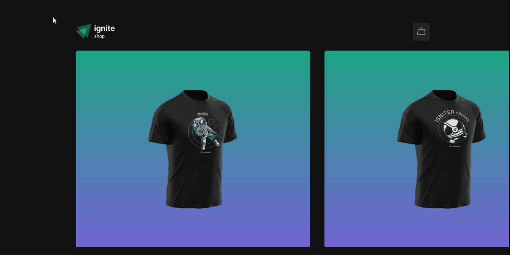

# Ignite shop - e-commerce

<p align="center">
  <a href="#-projeto">Project</a> &nbsp;&nbsp;&nbsp;|&nbsp;&nbsp;&nbsp;
  <a href="#-tecnologias">Technologies</a> &nbsp;&nbsp;&nbsp;|&nbsp;&nbsp;&nbsp;
  <a href="#how-to-use">How to use</a> &nbsp;&nbsp;&nbsp;|&nbsp;&nbsp;&nbsp;
  <a href="#common-mistakes">Common mistakes</a> &nbsp;&nbsp;&nbsp;|&nbsp;&nbsp;&nbsp;
  <a href="#common-mistakes">Nextjs info</a> &nbsp;&nbsp;&nbsp;|&nbsp;&nbsp;&nbsp;
  <a href="#project-vision">Project vision</a> &nbsp;&nbsp;&nbsp;|&nbsp;&nbsp;&nbsp;
</p>

## 💻 Project

This project was built to support the study of how to develop applications in react, Nextjs with framework, componetion, context and its features. It is applied concepts of components, properties, CRUD, api integration from stripe, SSR, SPA and SSG (concepts of renderization web site).

## 🚀 Technologies

This project was developed with the following technologies:

- JavaScript
- TypeScript
- React
- NextJS
- Stitches
- Radix UI
- Context API
- Stripe API
- Hooks
- Html
- Css

## How to use?

1. Download this repository and with your terminal, enter the directory

```
git clone SSH or HTTP
```

2. Select the folder you want to use first

```
cd folder
```

3. Run to install the dependencies

```
npm install
OR
yarn
```

4. And to start the application, run the command

```
npm run dev
OR
yarn dev
```

5. And run build

```
npm run build
OR
yarn build
```

6. Start aplication in production

```
npm run start
OR
yarn start
```

## Common mistakes

1. Check if your node is on version 16.8 or node lts

2. create account in stripe server

3. Add .env.local you key secret and public

## Nextjs info

To learn more about Next.js, take a look at the following resources:

- [Next.js Documentation](https://nextjs.org/docs) - learn about Next.js features and API.
- [Learn Next.js](https://nextjs.org/learn) - an interactive Next.js tutorial.

You can check out [the Next.js GitHub repository](https://github.com/vercel/next.js/) - your feedback and contributions are welcome!

## Deploy on Vercel

The easiest way to deploy your Next.js app is to use the [Vercel Platform](https://vercel.com/new?utm_medium=default-template&filter=next.js&utm_source=create-next-app&utm_campaign=create-next-app-readme) from the creators of Next.js.

Check out our [Next.js deployment documentation](https://nextjs.org/docs/deployment) for more details.

# Project vision



<p align="center">Made by Pedro Henrique Lima</p>
